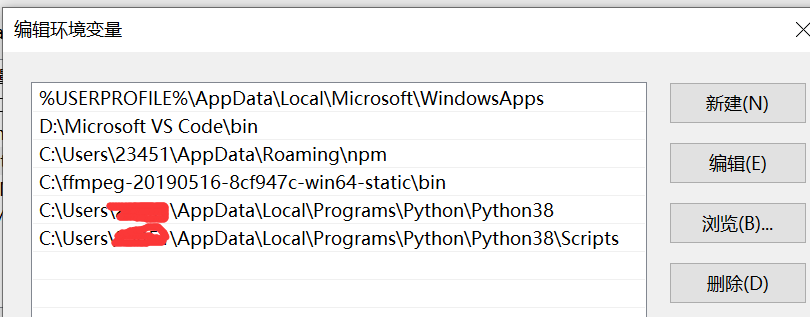
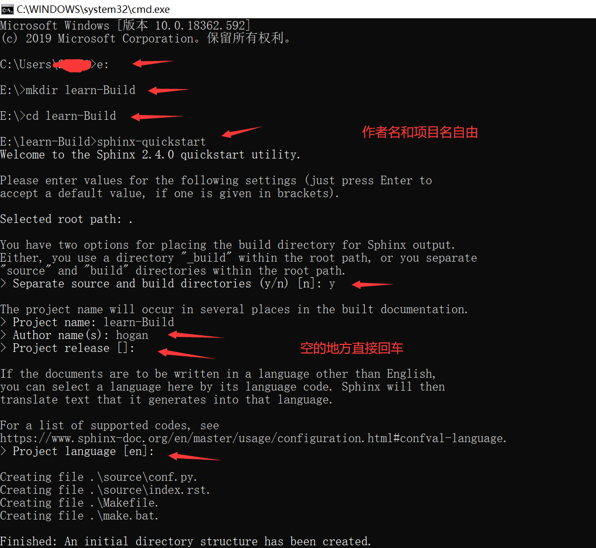
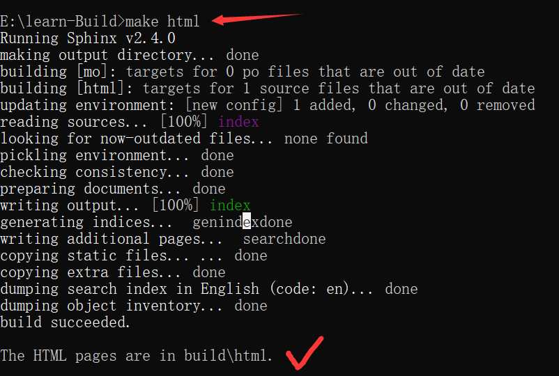
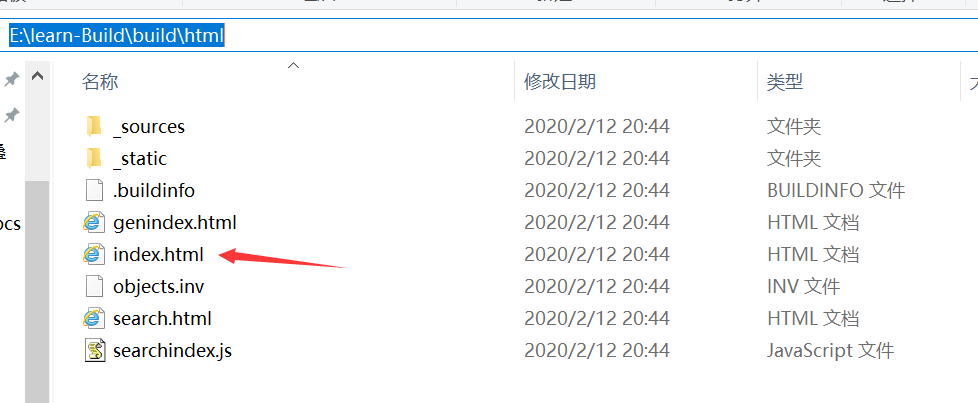
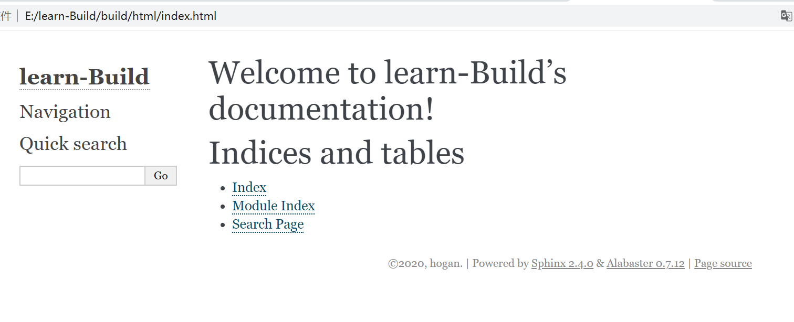
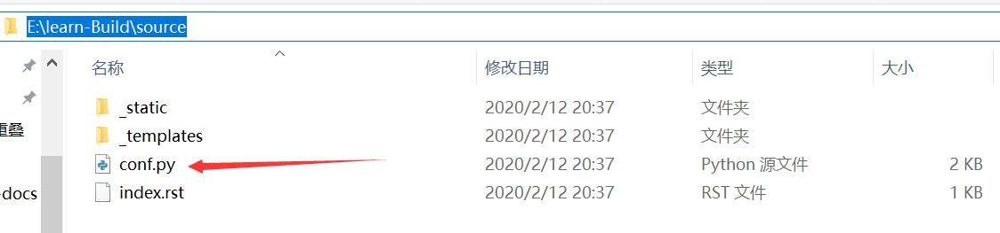
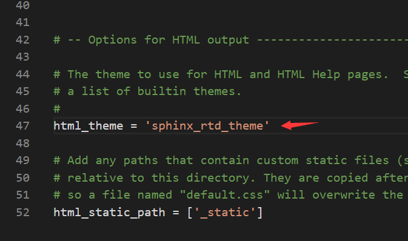

快速搭建Sphinx之基础准备
====================================

安装python
------------------------------------

由于sphinx依赖于python，所以我们需要先安装python  

- 点击随指引安装python `install Python`_ 
- 添加python和pip的环境变量  

安装sphinx并且快速构建一个文档
--------------------------------------  

- cmd安装sphinx  

.. prompt:: bash $

   pip install sphinx 

- 接着在cmd进行如下操作，建立sphinx框架文档 

- 可以看到文件夹下面已经初始好了基本文件

.. image:: _static/images/s3.png

- 在有make.bat的文件目录下，构建sphinx快速开始预设的的基础文档

- 构建好的静态页面就是这个index.html。有了本地构建，我们就能在每次写完文档上传前查看效果

``接下来我们对sphinx的所有配置更改都位于conf.py这个文件`` 

改变文档样式
-------------------------------------

- 将原本的'alabaster'替换成'sphinx_rtd_theme'

- 再次`make html`构建文档，可见样式和learn一样了

快速了解文档规则
--------------------------------------  

文档的编写默认是支持reStructuredText语言，也可以通过加载插件的方式支持markdown，但我个人推荐使用reStructuredText，因为它的使用更灵活，方式更多样,但同时也比较复杂。` 
语法参照 syntax_

文档内容放置在source/文件夹下即可，文档的入口是index.rst(也就是说打开文档右侧显示的内容就是index.rst，与此同时左侧的目录也是由index.rst文件中配置生成，具体可以参照本文档的github)。
其次是在index.rst中我们也可以嵌套其他的index.rst，但他们不能位于同一个目录级。

.. _syntax: http://www.sphinx-doc.org/en/master/usage/restructuredtext/basics.html   
.. _install Python: https://www.liaoxuefeng.com/wiki/1016959663602400/1016959856222624