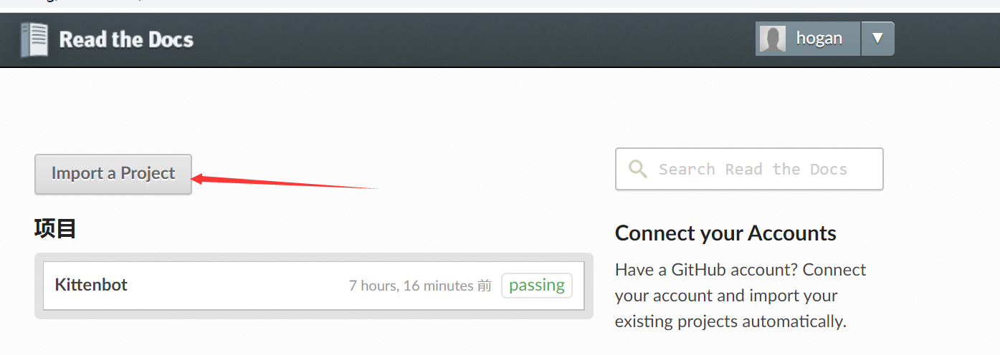
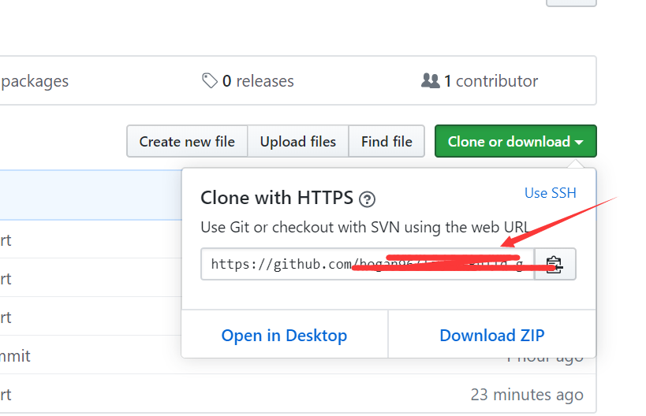
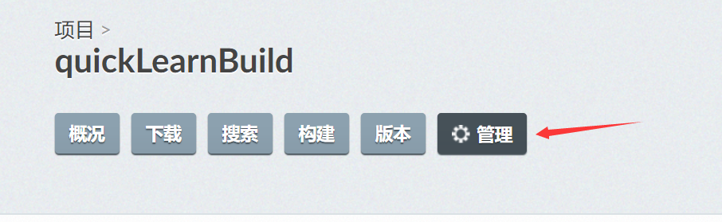
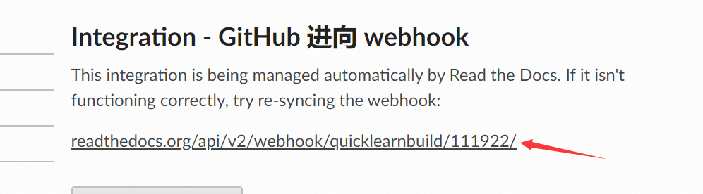
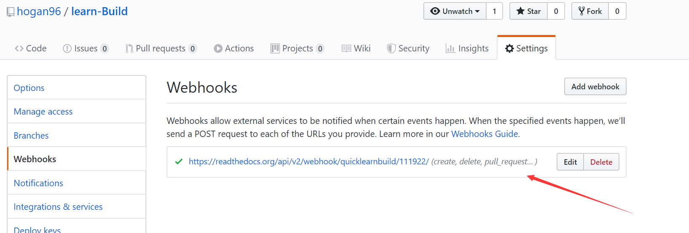
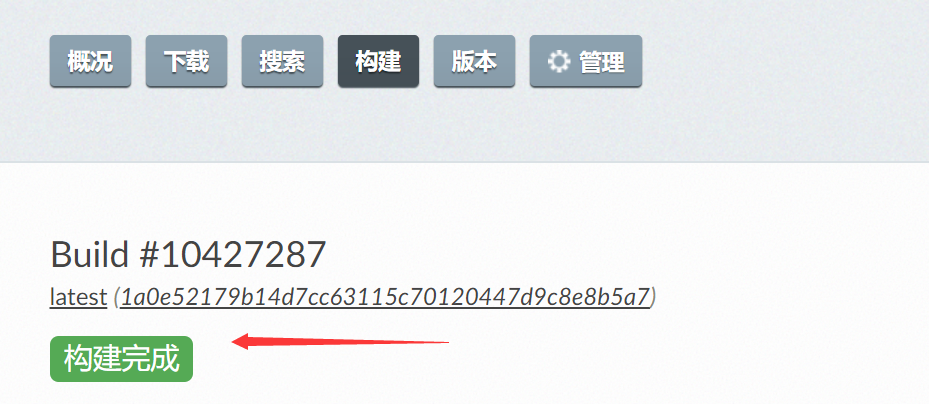

# 导入ReadtheDocs并建立钩子 

1.前往ReadtheDocs页面，并注册账号 [https://readthedocs.org/](https://readthedocs.org/) 

2.登录并进入我们的项目，选择Import a Project => 手动导入   

  

3.填入项目名字，代码链接使用     

  

4.进入管理页面，在下方语选择繁体，并Save 

 
  

5.再次进入管理=>集成=>添加集成=>集成类型默认Github进向webhook=>添加集成。复制这个链接  

  

6.在github仓库可见webhook已经自动连接成功。 

 

7.每次更新仓库，都会自动触发构建，时间随内容量几分钟到几十分钟不等。  

8.到这里已经成功了，我们通过概况下的网址已可以搜索到在线文档了。
接下来若想要更改域名，只需要购买域名，并在`管理=>域`中设置。