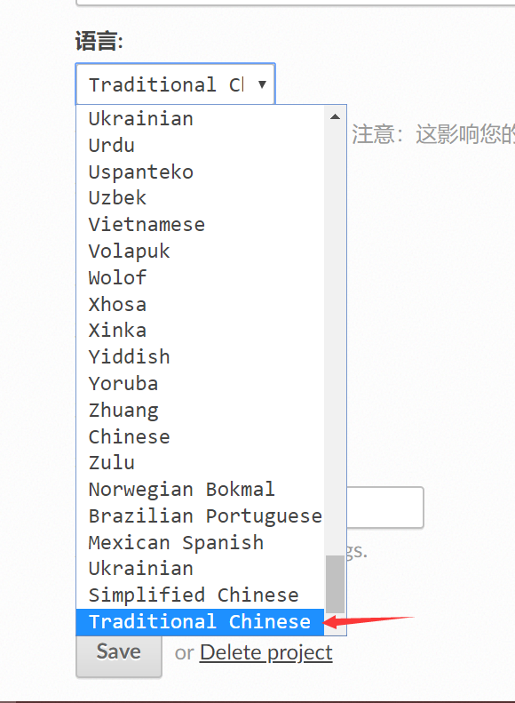

# 导入ReadtheDocs并建立钩子 

1.前往ReadtheDocs页面，并注册账号 [https://readthedocs.org/](https://readthedocs.org/) 

2.登录并进入我们的项目，选择Import a Project => 手动导入   

  

3.填入项目名字，代码链接使用     

  

4.进入管理页面，在下方语选择繁体，并Save 

 
  

5.再次进入管理=>集成=>添加集成=>集成类型默认Github进向webhook=>添加集成。复制这个链接  

  

6.在github仓库可见webhook已经自动连接成功。 

 

