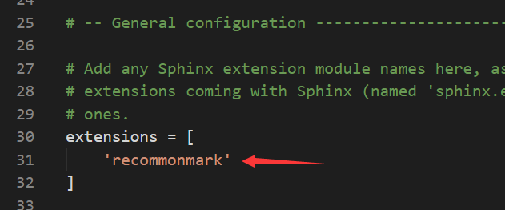

# 使用Markdown来编写文档 

`由于Sphinx默认的是.rst，使用Markdown则需要扩展支持` 

1.首先使用cmd本地安装 

```bash
    pip install recommonmark
```
  
2.在conf.py配置文件中加入这个扩展    

    
  
3.此时你就可以使用markdown进行编写了。当你第一次新增了markdown页面时，先在make.bat文件目录下使用make clean清除_build里的构建内容，再重新make html构建一次观察效果  

**需要注意的是，md的语法和rst有很大差别，在sphinx中，用rst来编写会更完美**